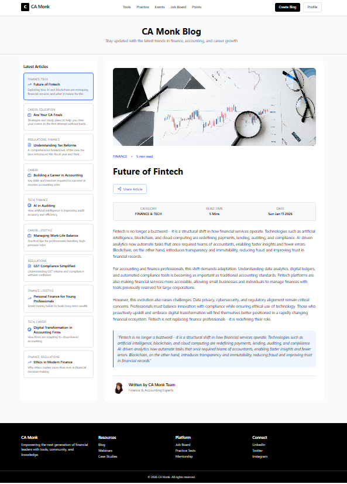
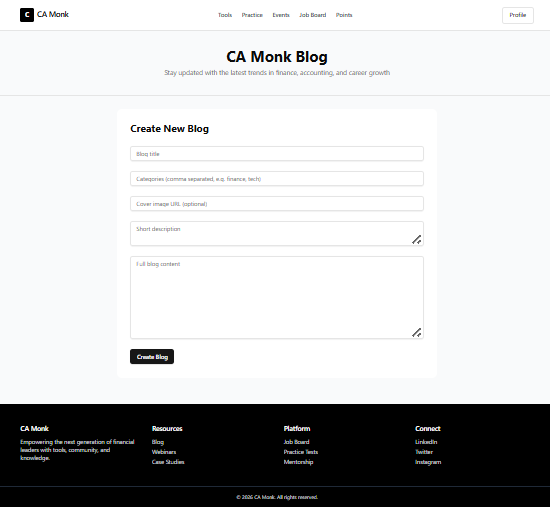

# CA Monk - Blog Application Assignment

A blog application built using React, TypeScript, TanStack Query,
Tailwind CSS, and shadcn/ui. The app allows users to read blogs and
create new blog posts using a JSON Server backend.

## Installation

### Prerequisites
- Node.js (v18 or higher)
- Git
- React.js knowledge
- Familiarity with TanStack Query, Tailwind CSS, and shadcn/ui.

### Setup Instructions

1. **Clone the repository**
   ```bash
   git clone <repository-url>
   cd camonk-blog-app
   ```

2. **Install dependencies**
   ```bash
   npm install
   ```
   


3. **Install required libraries for the assignment** 
 ie, TanStack Query, Tailwind CSS, and  shadcn/ui

 **Tailwind Installation**
   npm install -D tailwindcss@3 postcss autoprefixer
   npx tailwindcss init -p
   
4. **Start the JSON Server (Backend API)**
   ```bash
   npm run server
   ```
   The API will run on `http://localhost:3001`

5. **Start the Development Server (in a new terminal)**
   ```bash
   npm run dev
   ```
   The app will run on `http://localhost:5173`

## Assignment Tasks

You are required to build a blog application with the following features:

### Required Technologies
-  **TanStack Query** - For server state management and data fetching
  - 📚 [Documentation](https://tanstack.com/query/latest)
-  **Tailwind CSS** - For styling
  - 📚 [Documentation](https://tailwindcss.com/docs)
-  **shadcn/ui** - For UI components
  - 📚 [Documentation](https://ui.shadcn.com/)

## UI Reference

Here's a  design for the blog application layout:


**Left Panel:** Blog list view showing blog cards with category, title, and description  
**Right Panel:** Blog detail view displaying cover image, full content

UI IMAGE - 
CREATE BLOG IMAGE - 


